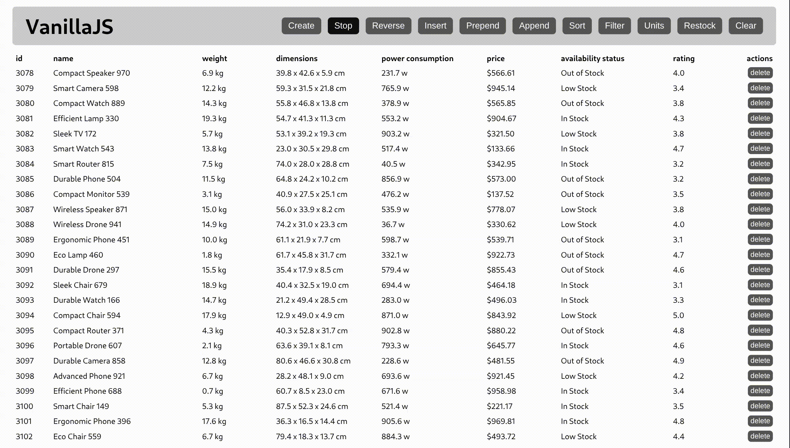

# JS Benchmarks

Experimental JavaScript framework benchmark. You can view the current results [here](https://jsbenchmarks.com).



## Goals

- **Benchmark common patterns**: Focus on varied and representative list reconciliation patterns found in real-world applications.
- **Maintainable scope**: Limit the number of implementations to a reasonable set. This facilitates easier exploration of results and allows the benchmark suite to evolve without the burden of updating a vast number of implementations.

## Implementation Requirements

- **Framework Selection**: Implementations must use frameworks that are either highly popular or notably efficient. (Specific metrics TBD).
- **Maintenance**: Frameworks must be actively maintained. (Specific criteria TBD).
- **Single Submission**: Only one submission per framework is allowed. Exceptions may be granted for major version changes or significant features in beta.
- **Component Structure**: Table rows must be implemented as a separate component. This ensures the benchmark correctly measures the efficiency of the framework's component abstraction.
- **Idiomatic Code**: Implementations must use plain, idiomatic patterns you would expect to see in official documentation or "getting started" guides. The intent is to benchmark frameworks as they are typically used, and to highlight frameworks that are performant or efficient by default. "Cheating" techniques such as manual DOM manipulation or manual event delegation are prohibited (with the sole exception of the Vanilla JS implementation). This is an area with judgment calls; if a framework has special performance-oriented capabilities (special props, flags, etc.), those may be considered for a separate `*-opt` implementation in the future.

## Running Benchmarks Locally

1. Install dependencies:

```bash
npm i
```

2. Start the static server (leave this running):

```bash
npm run serve
```

Now you can see the built implementation at http://localhost:3000/frameworks/vanillajs/dist/.

3. In another terminal, run the benchmarks (requires the server):

```bash
npm run bench
```

## Running Results UI

To view the benchmark results in a graphical interface:

```bash
cd results
npm i
npm run dev
```

## Benchmark CLI Flags

`npm run bench` runs `node benchmark/start.js`.

- `--frameworks` / `-f`: Comma-separated list of frameworks (directory names under `frameworks/`). Default: all frameworks.
- `--benchmarks` / `-b`: Comma-separated list of benchmarks to run. Default: all benchmarks.
- `--runs 2`: Run the benchmarks only 2 times. Default: 16 runs.
- `--help` / `-h`: Show help.

Examples:

```bash
npm run bench -- -f react,vue
npm run bench -- -b create,select,clear
```

## Inspiration

This project is heavily inspired by [krausest/js-framework-benchmark](https://github.com/krausest/js-framework-benchmark).

## Contributing

For each framework submission under `frameworks/<name>/`:

- Must include `npm run build`.
- `npm run build` must output the production build to a directory named `dist`.
- `package.json` must include `jsbenchmarks` metadata.

Example `frameworks/<name>/package.json`:

```json
{
  "name": "my-framework",
  "jsbenchmarks": {
    "website": "https://example.com",
    "package": "my-framework"
  },
  "scripts": {
    "build": "..."
  }
}
```
